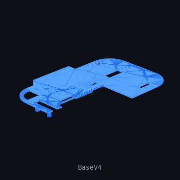
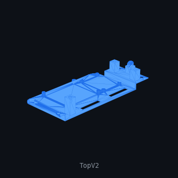
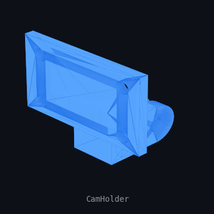
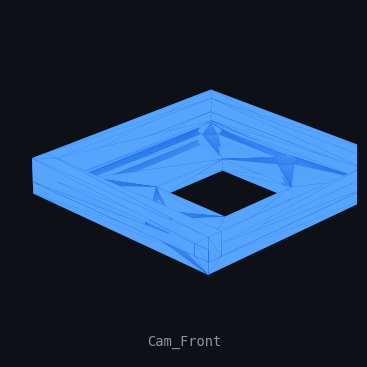
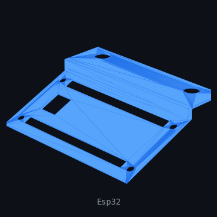
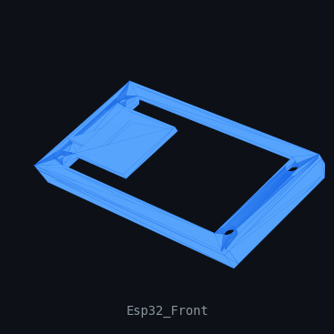
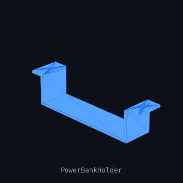
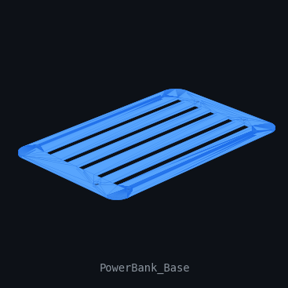
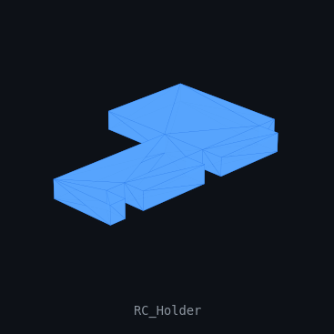
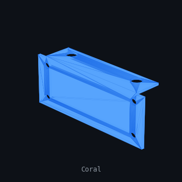

# UDR-Doc — URJC Deep Racer Vehicle

Documentation for building the **URJC Deep Racer**: an autonomous racing robot based on an Raspberry Pi 4, featuring a camera, RC receiver, Google Coral and external power bank.

---

## Repository Structure

```
udr-doc/
├── CAD/        # Editable source files (FreeCAD .FCStd)
├── STL/        # Print-ready 3D model files
├── previews/   # 3D models in png format
└── README.md
```

---

## Parts

### 🔩 Base — Main Chassis

The structural core of the vehicle. Iterated across four versions to reach the final geometry.

| Version | CAD | STL |
|---------|-----|-----|
| Base V1 (initial prototype) | [CAD/Base_V1.FCStd](CAD/Base_V1.FCStd) | — |
| Base V2 | [CAD/Base_V2.FCStd](CAD/Base_V2.FCStd) | — |
| Base V3 | [CAD/Base_V3.FCStd](CAD/Base_V3.FCStd) | — |
| Base V4 ✅ *(final)* | [CAD/Base_V4.FCStd](CAD/Base_V4.FCStd) | [STL/Base_V4.stl](STL/Base_V4.stl) |



---

### 🔝 Top Cover

Upper enclosure of the chassis. Three design iterations, V2 is the final version.

| Version | CAD | STL |
|---------|-----|-----|
| Top V0 (prototype) | [CAD/Top_V0.FCStd](CAD/Top_V0.FCStd) | — |
| Top V1 | [CAD/Top_V1.FCStd](CAD/Top_V1.FCStd) | — |
| Top V2 ✅ *(final)* | [CAD/Top_V2.FCStd](CAD/Top_V2.FCStd) | [STL/Top_V2.stl](STL/Top_V2.stl) |



---

### 📷 Camera Holder

Mount for securing the camera to the vehicle. Consists of a main bracket and a front-facing piece.

| Part | CAD | STL |
|------|-----|-----|
| Cam_Holder (main bracket) | [CAD/Cam_Holder.FCStd](CAD/Cam_Holder.FCStd) | [STL/Cam_Holder.stl](STL/Cam_Holder.stl) |
| Cam_Front (front piece) | [CAD/Cam_Front.FCStd](CAD/Cam_Front.FCStd) | [STL/Cam_Front.stl](STL/Cam_Front.stl) |

 

---

### 🖥️ ESP32 Holder

Mount for securing the ESP32 control board to the chassis. Includes a front panel for port access.

| Part | CAD | STL |
|------|-----|-----|
| Esp32 (main bracket) | [CAD/Esp32.FCStd](CAD/Esp32.FCStd) | [STL/Esp32.stl](STL/Esp32.stl) |
| Esp32_Front (front panel) | [CAD/Esp32_Front.FCStd](CAD/Esp32_Front.FCStd) | [STL/Esp32_Front.stl](STL/Esp32_Front.stl) |

 

---

### 🔋 Power Bank Holder

Housing for the external battery that powers the system. Two-piece design: a main holder and a base cradle.

| Part | CAD | STL |
|------|-----|-----|
| Power_Bank_Holder (main) | [CAD/Power_Bank_Holder.FCStd](CAD/Power_Bank_Holder.FCStd) | [STL/Power_Bank_Holder.stl](STL/Power_Bank_Holder.stl) |
| Power_Bank_Base (cradle) | [CAD/Power_Bank_Base.FCStd](CAD/Power_Bank_Base.FCStd) | [STL/Power_Bank_Base.stl](STL/Power_Bank_Base.stl) |

 

---

### 📡 RC Receiver Holder

Mount for the RC (radio control) receiver, enabling manual control alongside the autonomous mode.

| Part | CAD | STL |
|------|-----|-----|
| RC_Holder | [CAD/RC_Holder.FCStd](CAD/RC_Holder.FCStd) | [STL/RC_Holder.stl](STL/RC_Holder.stl) |



---

### 🪸 Coral

Additional structural or decorative piece of the assembly.

| Part | CAD | STL |
|------|-----|-----|
| Coral | [CAD/Coral.FCStd](CAD/Coral.FCStd) | [STL/Coral.stl](STL/Coral.stl) |



---

## How to Print

1. Download the `.stl` files from the [`STL/`](STL/) folder.
2. Import them into your slicer (Cura, PrusaSlicer, etc.).
3. Recommended orientation: flat faces on the bed.
4. Suggested material: **PLA or PETG**, infill ≥ 20%.

## How to Edit

Source files are in **FreeCAD** format (`.FCStd`). Requires [FreeCAD](https://www.freecad.org/) 0.20 or later.

